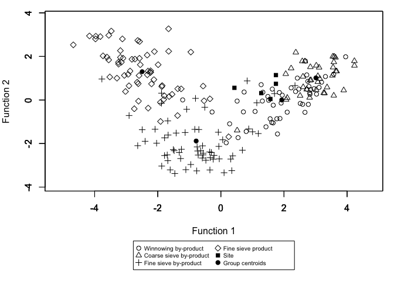
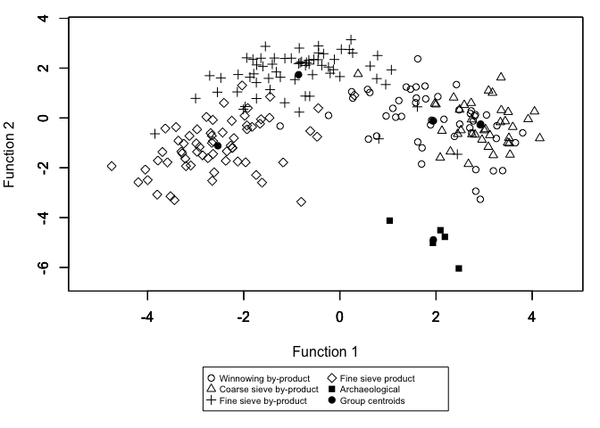
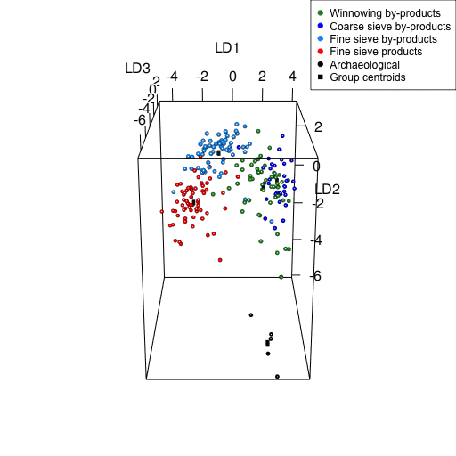

<!-- README.md is generated from README.Rmd. Please edit that file -->

# CropPro

<!-- badges: start -->
<!-- badges: end -->

This repository stores the CropPro package. CropPro contains functions
which can be used to classify archaeobotanical data against a linear
discriminant model derived from ethnographic data on the by-products of
crop processing stages. The package contains two linear discriminant
analysis (LDA) functions that can be used to classify the
archaeobotanical samples as one of four crop processing stages, or one
of five classes (four crop processing stages and the archaeological
group) and then plot them as two-dimensional or three-dimensional
graphs. This package also contains a function for the data
transformation required before LDA can be conducted, as well as a
function for plotting the ratio of grain to chaff to weed seeds in
comparison to ethnographic data.

## Referencing

The CropPro package draws on data from ethnographic research conducted
on the Greek island of Amorgos. The models were developed by Jones
(1984, 1987, 1990) and Charles (1997).

When publishing results obtained from the use of the CropPro package
please cite the package and its version, as well as the ethnographic
data. A best practice example paragraph is provided in Stroud *et al*.
(2023).

**Package citation**: Stroud, E., Jones, G., Charles, M., Bogaard, A. (2023) CropPro: Data organisation,
classification and visualistion of archaeobotanical data to understand
crop processing stage. R package version 1.0.0,
<https://github.com/CropPro-package/CropPro>

**Data sources \<**add**\>**

**Crop processing LDA model:**

Jones, G., (1984) *Interpretation of archaeological plant remains:
Ethnographic models from Greece.* In (eds) W. van Zeist & W.A. Casparie,
Plants and Ancient Man: Studies in Palaeoethnobotany. Rotterdam:
Balkema, pp 43-61

Jones, G., (1987). A statistical approach to the archaeological
identification of crop processing. *Journal of Archaeological Science*,
14(3), pp.311-323.

**Triplot model:**

Jones, G. (1990). The application of present-day cereal processing
studies to charred archaeobotanical remains. *Circaea* 6(2):91-96

**LDA plus model:**

Charles, M., (1998). Fodder from dung: the recognition and
interpretation of dung-derived plant material from archaeological sites,
*Environmental Archaeology*, 1:1, 111-122

## Installation

You can install the development version of CropPro from
[GitHub](https://github.com/) with:

``` r
# install.packages("devtools")
devtools::install_github("CropPro-package/CropPro")
```

## Crop processing LDA example

This is a basic example which shows you how to use the package to
understand crop processing stage represented within an archaeobotanical
assemblage :

``` r
library(CropPro)
#> Loading required package: dplyr
#> 
#> Attaching package: 'dplyr'
#> The following objects are masked from 'package:stats':
#> 
#>     filter, lag
#> The following objects are masked from 'package:base':
#> 
#>     intersect, setdiff, setequal, union
#> Loading required package: MASS
#> 
#> Attaching package: 'MASS'
#> The following object is masked from 'package:dplyr':
#> 
#>     select
#> Loading required package: rgl
## basic example code
# Sample data
species<-c("Chenopodium album" , "Anthemis cotula", "Brassica rapa ssp campestris",
"Raphanus raphanistrum", "Agrostemma githago" , "Poa annua" )
category<-c("SFH", "BHH","SFH","BHH","BFH", "SFL" )
s.1246<-c(2,2,3,7,1, 6)
s.46178<-c(1,1,0,0,2,5)
s.1<-c(0,2,2,8,1,8)
s.23<-c(0,3,2,3,0,0)
s.987<-c(3,9,6,8,0,1 )
dataset<-data.frame(species,category,s.1246,s.46178,s.1,s.23,s.987)
dataset
#>                        species category s.1246 s.46178 s.1 s.23 s.987
#> 1            Chenopodium album      SFH      2       1   0    0     3
#> 2              Anthemis cotula      BHH      2       1   2    3     9
#> 3 Brassica rapa ssp campestris      SFH      3       0   2    2     6
#> 4        Raphanus raphanistrum      BHH      7       0   8    3     8
#> 5           Agrostemma githago      BFH      1       2   1    0     0
#> 6                    Poa annua      SFL      6       5   8    0     1
```

The sample data, showing species, classification and 5 different samples
: s.1246, s.46178, s.1, s.23, s.987, needs to be transformed and
transposed for the LDA. The function crop.dataorg can do that.

``` r
data<-crop.dataorg(dataset, codes=2, samples=3)
data
#>   samples       BHH      BFH SHH SHL      SFH      SFL
#> 1  s.1246  8.859570 2.182179   0   0 6.865712 5.345225
#> 2 s.46178  3.333333 4.714045   0   0 3.333333 7.453560
#> 3     s.1  9.258201 2.182179   0   0 3.086067 6.172134
#> 4    s.23 12.247449 0.000000   0   0 5.000000 0.000000
#> 5   s.987 11.216813 0.000000   0   0 8.047379 1.924501
```

The organised data can then be analysed using LDAcrop.pro which will
classify the data against the ethnographic model.

``` r
results<-LDAcrop.pro(data)
#> [1] "Classification results and linear discriminant scores "
#>   samples Class_std* Prob.1_std* Prob.2_std* Prob.3_std* Prob.4_std*  LD1*
#> 1  s.1246          1       1.000       0.000           0           0 1.279
#> 2 s.46178          1       1.000       0.000           0           0 0.429
#> 3     s.1          1       1.000       0.000           0           0 1.744
#> 4    s.23          1       0.988       0.012           0           0 1.744
#> 5   s.987          1       0.999       0.000           0           0 1.570
#>    LD2*   LD3*
#> 1 0.315 -6.143
#> 2 0.558 -6.764
#> 3 1.143 -6.720
#> 4 0.743 -2.291
#> 5 0.045 -3.811
#> [1] "classification table"
#>                         Count Percentage
#> Winnowing by-product        5        100
#> Coarse sieve by-product     0          0
#> Fine sieve by-product       0          0
#> Fine sieving product        0          0
```

The results from LDAcrop.pro can be plotted as either a static 2D or
interactive 3D graph.

``` r
crop.plot2D(results)
```



``` r
crop.plot3D(results)
```


## LDA.plus example

There are alternative functions within the package which allow for
classification of the entered data against a model constructed from the
ethnographic data **and** the entered data. This provides the LDA an
alternative group of “archaeological” when classifying the entered data.
The workflow is similar to above, except with the use of the “dung”
suite of functions: LDAcrop.plus, crop.plus_plot2D, crop.plus_plot3D.

``` r
plus_results<-LDAcrop.plus(data)
#> [1] "Classification results and linear discriminant scores"
#>    Sample CLASS_std* Prob.1_std* Prob.2_std* Prob.3_std* Prob.4_std*
#> 1  s.1246          5           0           0           0           0
#> 2 s.46178          5           0           0           0           0
#> 3     s.1          5           0           0           0           0
#> 4    s.23          5           0           0           0           0
#> 5   s.987          5           0           0           0           0
#>   Prob.5_std*  LD1*   LD2*   LD3*   LD4*
#> 1           1 1.935 -5.015 -6.926  0.098
#> 2           1 1.036 -4.123 -5.220 -2.164
#> 3           1 2.474 -6.041 -6.972  0.013
#> 4           1 2.184 -4.773 -5.706  3.663
#> 5           1 2.092 -4.508 -6.602  2.344
#> [1] "classification table"
#>                          Count Percentage
#> Winnowing by-product         0          0
#> Coarse sieveg by-product     0          0
#> Fine sieve by-product        0          0
#> Fine sieve product           0          0
#> Archaeological               5        100
crop.plus_plot2D(plus_results)
```



``` r
crop.plus_plot3D(plus_results)
```


